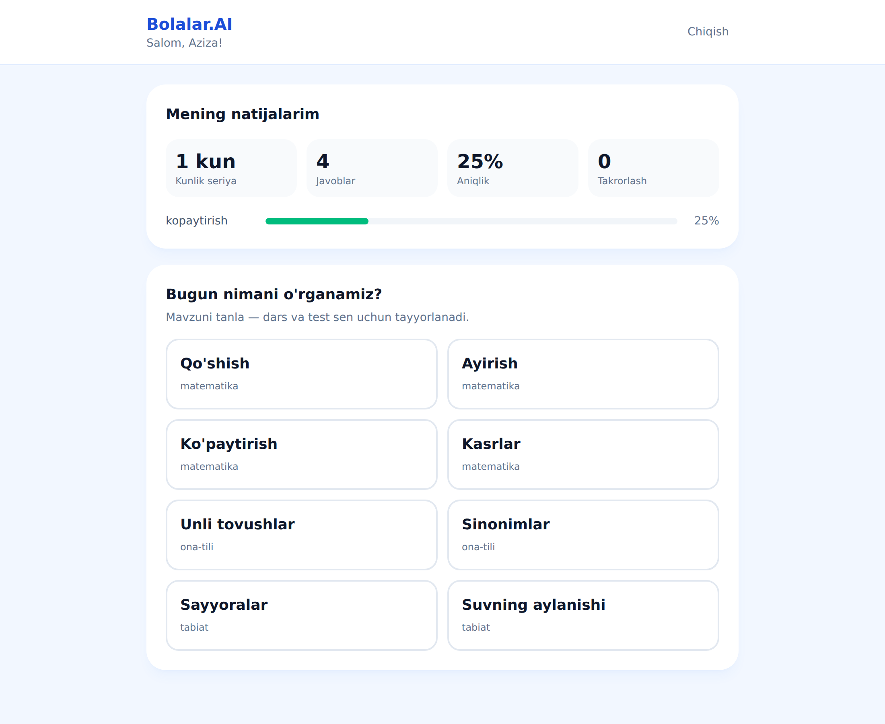
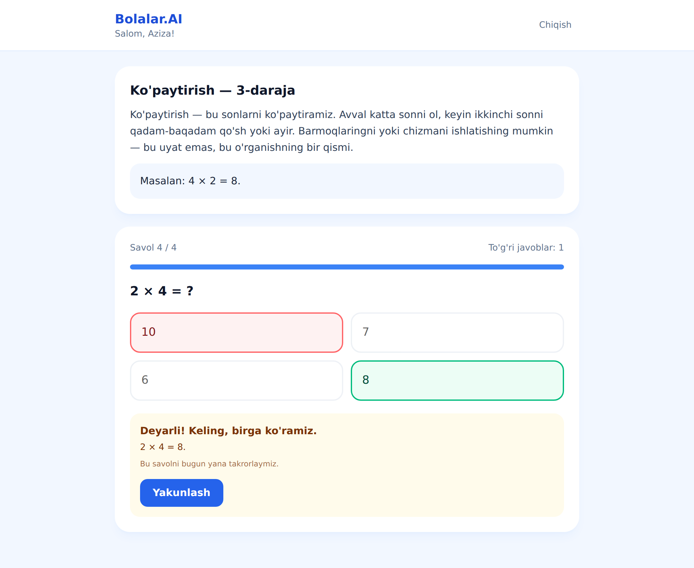
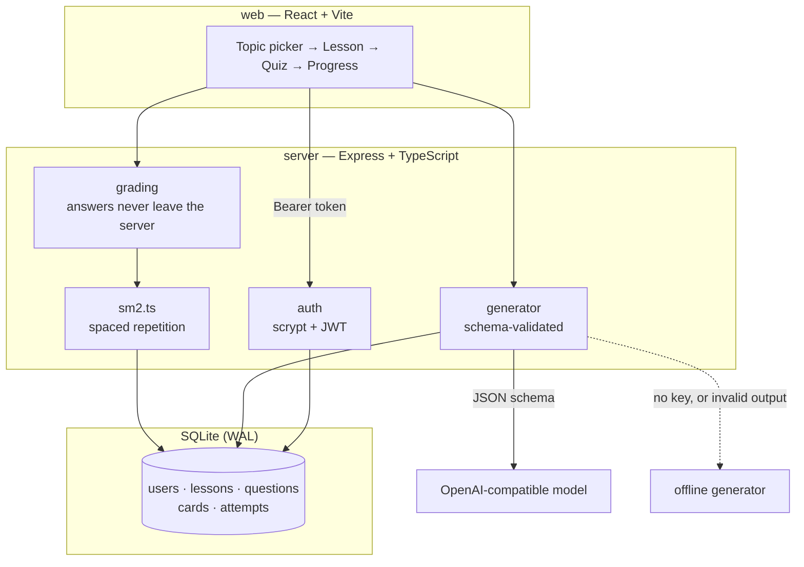

# Bolalar.AI

**An AI tutor for Uzbek-speaking children.** Pick a topic, get a short lesson written for your age,
answer a quiz, and have the questions you got wrong come back exactly when you are about to forget
them.

The interesting part is not the chat box — it is what sits around the model: an age-gated
curriculum, a schema-validated generation pipeline that refuses unusable model output, server-side
grading, and a spaced-repetition scheduler that decides what to ask next.

**[→ Live demo](https://bolalar-ai.vercel.app)** — no sign-up needed to look around; register a
child profile in a few seconds to take a lesson. The API sleeps when idle, so the very first
request can take up to a minute to wake it.

<p align="center">
  
  
</p>

---

## Why this exists

There is very little study software for children in Uzbek. Generic AI chatbots technically speak
the language, but they will happily invent facts, drift off topic, and hand a nine-year-old a wall
of text. This project is an attempt to answer the harder question: **how do you put a language model
in front of a child and still be able to say what it will and will not do?**

The answer here has four parts:

1. **A closed curriculum.** Children choose from a fixed topic list filtered by age. The model is
   never asked an open-ended "teach me anything".
2. **Structured output, validated twice.** Generation is constrained by a JSON schema, then checked
   by Zod for shape and by `assertCoherent` for meaning (duplicate options, an answer index pointing
   at nothing, a repeated question). Failures are retried, then abandoned.
3. **A real fallback.** With no API key the app is still fully usable: arithmetic questions are
   *computed*, so they cannot be wrong, and factual topics come from a curated bank rather than from
   a model that might hallucinate at a child.
4. **The server owns the truth.** Correct answers are never sent to the browser. Grading, scheduling
   and progress all happen server-side.

---

## Features

- Register / login with JWT sessions and scrypt-hashed passwords
- Age-filtered topic list and age-derived difficulty (1–5)
- Lesson + multiple-choice quiz generated per child, per topic, per day
- Immediate feedback with an explanation of *why* an answer is right
- **SM-2 spaced repetition**: correct answers push the card 1 → 6 → 6×ease days out, a lapse
  re-queues it in 10 minutes rather than days
- Progress dashboard: streak, accuracy, per-topic breakdown, cards due now
- Per-IP rate limiting, structured error responses, graceful shutdown

---

## Architecture



### The generation pipeline

```
topic + age → difficulty → prompt (constrained)
                        → model → JSON schema response
                        → Zod validation        ─┐ fail
                        → assertCoherent         ├→ retry once → offline generator
                        → store lesson + questions
```

---

## Quick start

```bash
git clone https://github.com/zukhriddin1/bolalar-ai.git
cd bolalar-ai
npm install

cp .env.example server/.env      # optional; sensible defaults exist
npm run dev                      # API on :4000, web on :5173
```

Open <http://localhost:5173>, register a child, pick a topic. **No API key is required** — the
offline generator handles every topic in the curriculum.

To use a real model, set `OPENAI_API_KEY` in `server/.env`. `OPENAI_BASE_URL` points the same code
at Ollama, LM Studio, Groq or any OpenAI-compatible endpoint.

### Deploy

The two halves go to different platforms, and that split is not an accident: the
API needs a long-running process, a native SQLite module and a writable
filesystem, so it cannot run as a serverless function.

**API → Render.** The repository ships a [`render.yaml`](render.yaml) blueprint.
Point Render at the repo, and it builds `server/Dockerfile`, generates
`JWT_SECRET` and exposes `/health` as the health check. After the frontend is up,
set `CORS_ORIGIN` to its URL. On the free plan the SQLite file resets when the
service restarts, which is fine for a public demo — attach a disk at `/data` to
make it durable.

**Web → Vercel.** Import the repo at [vercel.com/new](https://vercel.com/new) and
set **Root Directory** to `web`. Add one environment variable:

```
VITE_API_URL = https://<your-api>.onrender.com
```

Vite inlines it at build time, so redeploy the frontend after changing it. Left
unset, the client calls `/api` on its own origin, which is what the dev-server
proxy expects locally.

Free Render instances sleep when idle, so the first request after a quiet period
takes a few seconds to wake the API.

### Docker

```bash
JWT_SECRET=$(node -e "console.log(require('crypto').randomBytes(32).toString('hex'))") \
  docker compose up --build
```

---

## API

All routes except `/health` and `/api/auth/*` require `Authorization: Bearer <token>`.

| Method | Route | Description |
|---|---|---|
| `GET` | `/health` | Liveness plus which generator is active |
| `POST` | `/api/auth/register` | `{ username, displayName, password, age }` → token |
| `POST` | `/api/auth/login` | `{ username, password }` → token |
| `GET` | `/api/auth/me` | Current child |
| `GET` | `/api/lessons/topics` | Topics appropriate for this child's age |
| `POST` | `/api/lessons` | `{ topic, difficulty? }` → generated lesson (answers stripped) |
| `GET` | `/api/lessons` | Recent lessons |
| `GET` | `/api/lessons/:id` | One lesson, scoped to the owner |
| `POST` | `/api/lessons/answer` | `{ questionId, chosenIndex, secondsTaken?, hintUsed? }` → grade + next review |
| `GET` | `/api/review/due` | Cards whose review is due |
| `GET` | `/api/progress` | Streak, accuracy, per-topic stats |

```bash
curl -X POST localhost:4000/api/auth/register \
  -H 'Content-Type: application/json' \
  -d '{"username":"aziza","displayName":"Aziza","password":"parol-12345","age":9}'
```

---

## The spaced repetition, concretely

`gradeFromAnswer` turns what we observe (correct / time taken / hint used) into an SM-2 quality
score, because a child-facing UI cannot ask "rate your recall from 0 to 5":

| Observation | Quality |
|---|---|
| Correct, under 20s, no hint | 5 |
| Correct, but slow **or** hinted | 4 |
| Correct, slow **and** hinted | 3 |
| Wrong, after a hint | 1 |
| Wrong | 0 |

Quality below 3 resets `repetitions` and makes the card due in **10 minutes** — inside the same
study session, which is what actually repairs a misconception. Above 3, the interval walks
1 day → 6 days → `previous × easeFactor`, and the ease factor itself drifts up on easy recalls and
down on hard ones, floored at 1.3.

---

## Design decisions

**Why SQLite?** One writer, tiny dataset, and the deployment target is a single box. WAL mode plus
`better-sqlite3`'s synchronous API removes an entire class of connection-pool bugs, and the whole
database is one file to back up. The data access is plain SQL in the route layer, so moving to
Postgres later is a driver swap, not a rewrite.

**Why scrypt instead of bcrypt?** It is memory-hard, it is in Node's standard library, and it means
no native module to compile in CI or in the Docker image. Salt and hash live in a single column.

**Why is the correct answer never sent to the client?** Because otherwise the quiz is decorative.
`loadLesson` explicitly omits `answer_index`, and the API test asserts that it stays omitted — that
test is there to fail loudly if someone later "simplifies" the serialiser.

**Why hand-rolled rate limiting and CORS?** Both are ~40 lines for the behaviour this app needs, and
both are things a reviewer should be able to read end to end. Dependencies earn their place.

**Why seed lesson generation on user + topic + date?** A child who reloads the page should see the
same lesson, not a new one — but tomorrow should be fresh. Hashing those three things gives that for
free, with no extra state.

---

## Testing

```bash
npm test          # 51 tests
npm run typecheck
```

The suite is split between the algorithm and the contract:

- **`sm2.test.ts`** — interval progression, lapse handling, ease-factor floor, quality derivation
- **`generator.test.ts`** — every topic produces a schema-valid, coherent lesson; arithmetic answers
  are verified by recomputing them; the correct answer is not always in the same slot; generation is
  deterministic per seed
- **`auth.test.ts`** — scrypt round-trip, salting, malformed-hash handling, streak arithmetic
- **`api.test.ts`** — full HTTP integration against an in-memory database: registration, login
  timing parity, ownership isolation between two children, answer grading, review queue, progress

The tests that matter most are the ones asserting a *negative*: that the password hash never appears
in a response, that `answerIndex` never reaches the client, and that one child cannot read or answer
another child's questions.

---

## Project layout

```
server/
├─ src/
│  ├─ ai/          curriculum, prompt + schema, offline generator, provider
│  ├─ auth/        scrypt hashing, JWT issuing and verification
│  ├─ db/          migrations and connection
│  ├─ domain/      sm2.ts — the scheduling algorithm, framework-free
│  ├─ http/        error taxonomy, rate limiter
│  └─ routes/      auth, lessons, review, progress
└─ tests/          unit + HTTP integration

web/
└─ src/            api client, auth screen, quiz, progress dashboard
```

---

## Roadmap

- [ ] Parent dashboard with weekly summaries
- [ ] Text-to-speech for pre-readers
- [ ] Illustrations generated per lesson
- [ ] Offline PWA mode for unreliable connections
- [ ] More topics, and a contribution format for teachers to add their own

## Tech stack

TypeScript (strict) · Express 5 · SQLite (better-sqlite3, WAL) · Zod · JWT · Vitest + Supertest ·
React 19 · Vite · Tailwind CSS 4 · Docker

## License

MIT — see [LICENSE](LICENSE).
